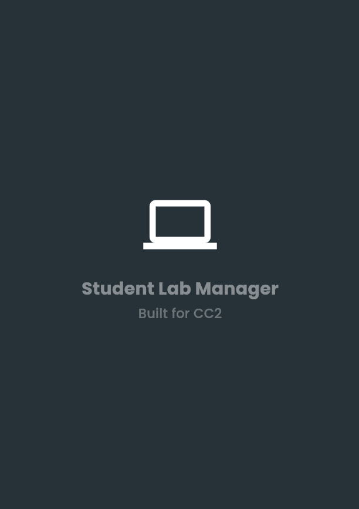
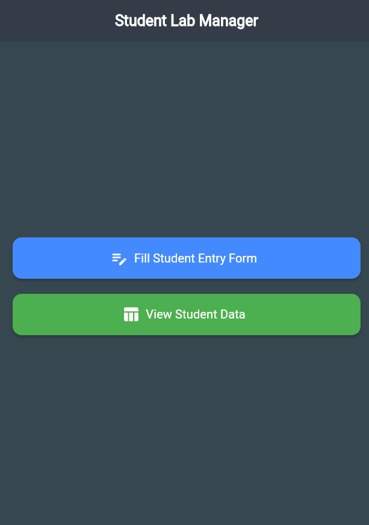
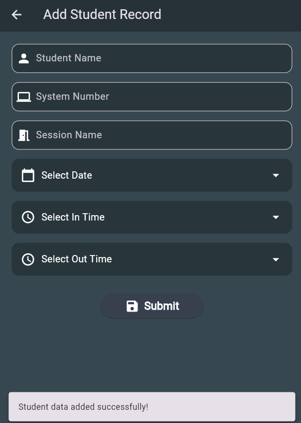
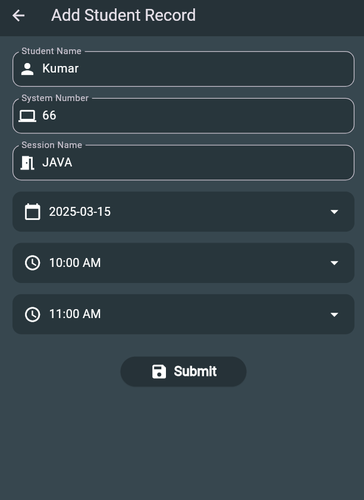
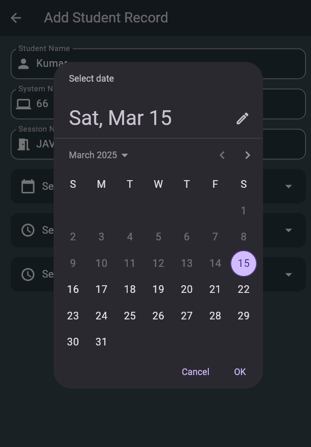
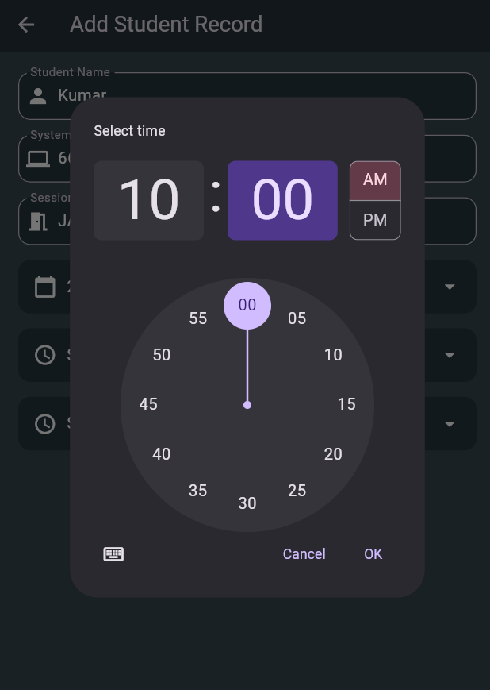
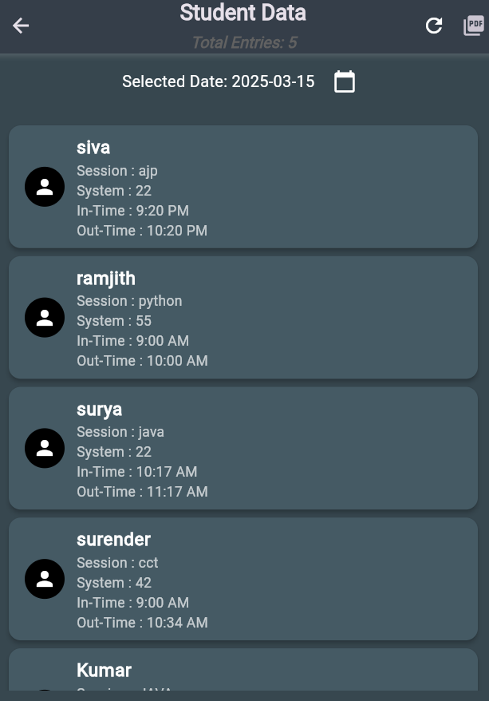
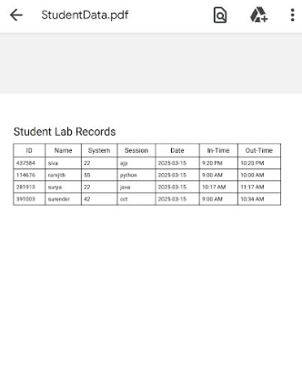

# **📚 Student Lab Manager**

🔬 **A Flutter-based Student Lab Management System** designed to streamline and digitize the process of managing student entries in a lab. This application provides an intuitive interface to record, view, and export student entry data, all while integrating seamlessly with Google Sheets for cloud-based storage. 🚀

---

## **✨ Features**

### **1️⃣ Splash Screen**
- Displays an engaging startup animation.
- Ensures a smooth transition to the **Home Screen**.

### **2️⃣ Home Screen**
- Provides two main functionalities:
  - 📝 **Fill Student Entry Form** → Navigate to the form page.
  - 📋 **View Student Records** → Check previously entered records.

### **3️⃣ Student Entry Form**
- Students can enter their lab details, including:
  - 👤 **Student Name**  
  - 💻 **System Number** (assigned system for lab work)  
  - 📚 **Session Name** (Course or lab session details)  
  - 📅 **Select Date** (Date of the lab visit)  
  - ⏰ **In-Time & Out-Time** (Check-in and check-out timings)  
- ✅ **Upon submission, the data is stored in a Google Spreadsheet** named **"Students"** for future reference.

### **4️⃣ View Students Page**
- Displays student records stored in Google Sheets.
- **Functionalities:**
  - 🔄 **Refresh Button** – Fetch the latest entries from Google Sheets.
  - 📅 **Date Picker** – Select a specific date to filter records.
  - 📊 **Total Entries Count** – Displays the number of records for the selected date.
  - 📥 **Download PDF** – Generates and downloads a **PDF** file of the filtered records.

---

## **📸 Screenshots**

| Splash Screen | Home Screen | Student Form |
|--------------|------------|-------------|
|  |  |  |

| Filled Form | Date Selection | Time Selection |
|--------------|--------------|--------------|
|  |  |  |

| Student List | PDF Export |
|--------------|------------|
|  |  |

---

## **🛠️ Installation & Setup**

### **🔹 Prerequisites**
- Install **Flutter** (latest stable version) → [Flutter Installation Guide](https://flutter.dev/docs/get-started/install)
- Configure an **Android Emulator** or connect a **physical device**
- Enable **Google Sheets API** and obtain required API credentials

### **🔹 Steps to Run the Project**

1️⃣ **Clone the Repository**
```sh
   git clone https://github.com/Surya-2k4/Student-Lab-Manager.git
   cd Student-Lab-Manager
```

2️⃣ **Install Dependencies**
```sh
   flutter pub get
```

3️⃣ **Run the App**
```sh
   flutter run
```

4️⃣ **Build the APK (Optional)**
```sh
   flutter build apk
```

---

## **📂 Tech Stack**

| Technology | Purpose |
|------------|---------|
| 📱 **Flutter** | Frontend UI framework |
| 📊 **Google Sheets API** | Storing and managing student entries |
| 📄 **PDF Generation** | Exporting student records |
| 📆 **Date & Time Picker** | Filtering student records by date |

---

## **🚀 How It Works**

### **📝 Data Entry Process**
1. A student opens the app and lands on the **Home Screen**.
2. The student clicks **"Fill Student Entry Form"**.
3. The form collects the required details.
4. On submission, the data is stored in Google Sheets.
5. A success message confirms the entry.

### **📋 Viewing & Exporting Records**
1. The user navigates to the **View Students Page**.
2. They select a **date** using the **date picker**.
3. The app fetches and displays the filtered records.
4. Users can **refresh** the data anytime.
5. To export, they click on the **PDF download** button.

---

## **💡 Future Enhancements**

✅ **User Authentication** – Secure login for students and admins.
✅ **Admin Dashboard** – Separate module for admin management.
✅ **Offline Data Storage** – Save entries even without an internet connection.
✅ **Email Notifications** – Send automated confirmation emails.
✅ **Dark Mode Support** – Enhance UI experience.

---

## **📞 Contact**

💡 **Developed by:** [Surya](https://github.com/Surya-2k4)  
📧 **Email:** [suryanatarajan04@gmail.com]  
🌐 **GitHub:** [Student-Lab-Manager](https://github.com/Surya-2k4/Student-Lab-Manager)  

🚀 **Feel free to contribute, report issues, or suggest improvements!** 🎉

